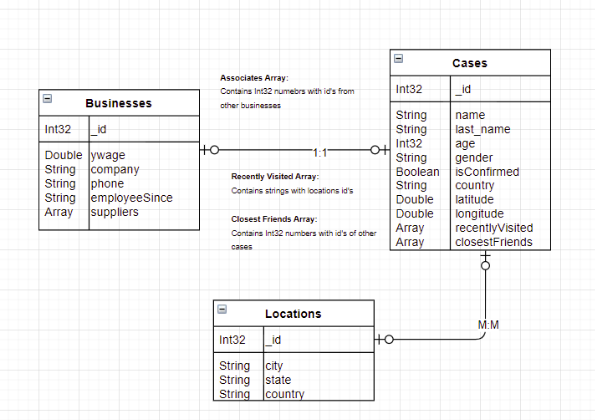
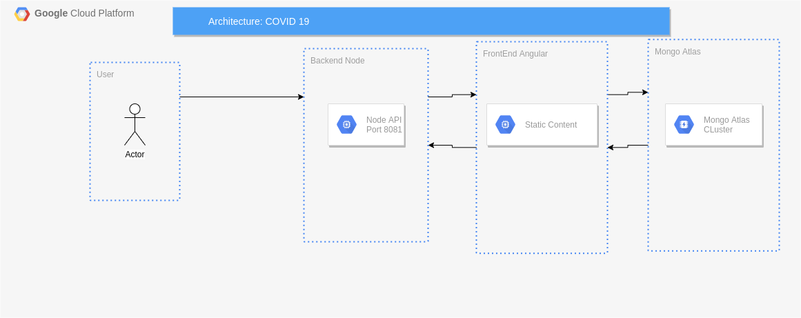

# Tarea 3. Bases de datos NoSQL (MongoDB)

---

##### Integrantes:
1. *Daniel Charua* - *A01017419* - *CSF*
2. *Roberto Alejandro Gutiérrez Guillén* - *A01019608* - *CSF*
3. *Eduardo Badillo Álvarez* - *A01020716* - *CSF*
4. *Sergio Hernandez Castillo* - *A01025210* - *CSF*

---
## 1. Aspectos generales

Las orientaciones de la tarea se encuentran disponibles en la plataforma **Canvas**.

Este documento es una guía sobre qué información debe entregar como parte de la tarea, qué requerimientos técnicos debe cumplir y la estructura que debe seguir para organizar su entrega.


### 1.1 Requerimientos técnicos

A continuación se mencionan los requerimientos técnicos mínimos de la tarea, favor de tenerlos presente para que cumpla con todos.

* El equipo tiene la libertad de elegir las tecnologías de desarrollo a utilizar en la tarea, sin embargo, debe tener presente que la solución final se deberá ejecutar en una plataforma en la nube. Puede ser  [Google Cloud Platform](https://cloud.google.com/?hl=es), [Azure](https://azure.microsoft.com/en-us/), [AWS](https://aws.amazon.com/es/free/) u otra.
* La arquitectura de la solución deberá estar separada claramente por capas (*frontend*, *backend*, datos y almacenamiento).
* Todo el código, *scripts* y la documentación de la tarea debe alojarse en este repositorio de GitHub, siguiendo la estructura que aparece a continuación.

### 1.2 Estructura del repositorio

El proyecto debe seguir la siguiente estructura de carpetas:
```
- / 			        # Raíz de toda la tarea
    - README.md			# Archivo con la información general de la tarea (este archivo)
    - frontend			# Carpeta con la solución del frontend (Web app)
    - backend			# Carpeta con la solución del backend (API)
    - scripts		        # Carpeta con los scripts necesarios para generar la base de datos, cargar datos y ejecutar las consultas
    - database			# Carpeta con el modelo de la bases de datos utilizando JSON Schema

```

### 1.3 Documentación de la tarea

Como parte de la entrega de la tarea, se debe incluir la siguiente información:

* Diagrama del *Modelo de la base de datos utilizando JSON Schema*.
* *Scripts* para generar la base de datos, cargar datos y ejecutar consultas.
* Guía de configuración, instalación y despliegue de la aplicación en la plataforma en la nube  seleccionada.
* El código debe estar documentado siguiendo los estándares definidos para el lenguaje de programación seleccionado.

## 2. Solución

A continuación aparecen descritos los diferentes elementos que forman parte de la solución de la tarea.

### 2.1 Modelo de la *base de datos* 

*[Incluya aquí el modelo JSON Schema y explique los patrones utilizados en cada caso.*



El patrón de modelación de nuestra base de datos es referencial. Es decir, en vez de embeber subdocumentos como parte de una colección para denotar relación se guardan referencias en los documentos a documentos en otras colecciones. 

* La colección Cases guarda una relación referencial con Businesses 1:1 (Businesses._id)<->(Cases._id)
* La colección Cases guarda una relación referencial con Locations 1:1 (Cases._id)<->(Locations._id)
* La colección Cases guarda una relacion referencial con si misma 1:N Vector(closestFriends[])*->(Cases._id)
* La colección Businesses guarda una relación referencial con si misma 1:N Vector(suppliers[])*->(Businesses._id)
### 2.2 Arquitectura de la solución



La base de datos esta configurada como una arquitectura de desarrollo en Mongo. Es decir, consiste de un solo replica set de 3 nodos y otro replica set de configuración. 
El backend esta ejecutandose en una VM dentro de AppEngine que sirve el contenido desde el puerto 8080, al recibir las solicitudes a su IP  ngix redirige el trafico al backend, este se conecta con el cluster de MongoAtlas y llama al frontend como contenido estático el cual esta almacenádo en un bucket de GCP.

### 2.3 Frontend
El frontend fue desarrollado en Angular, para poder ejecutarlo en local se debe de tener instalada el CLI de angular, para instalarla porfavor consultar el siguiente [link](https://cli.angular.io/)

Dentro de la carpeta frontend se deben de instalar las dependencias con el siguiente código
```bash
npm install
```

Posteriormente para compilar el front se debe ejecutar 
```bash
ng build --aot
```

Lo cual genera la carpeta dist/ con el contenido estático de la aplicación


Si se quiere ejecutar en servidor local se usa el comando 
```bash
ng serve
```
El front estará corriendo en el puerto 4200 y si esta ejecutando tambien el backend se comunicará a la base de datos

#### 2.3.1 Lenguaje de programación
Los lenguajes de programación utilizados para el desarrollo del frontend fueron: HTML, SCSS y TypeScript.
#### 2.3.2 Framework
El framework utilizado para el desarrollo del frontend fue: [Angular](https://angular.io/). Es un framework de código abierto, para el desarrollo de aplicaciones web de una sola página desarrollado por google.

#### 2.3.3 Librerías de funciones o dependencias
Para el diseño de las pantallas botones y assets de la aplicación se utilizó [Bootstrap](https://getbootstrap.com/) con sus modificaciones necesarias para una mejor visualización y UI.

Una de las librerias mas importantes es RXJS ya que es un dependencia que te permite hacer peticiones http y procesarlas para que puedas ocupar la información que necesites de las bases de datos que procesa el backend y los microservicios.

### 2.4 Backend

Para backend se creo una API REST en Node, que se conecta al cluster de Mongo Atlas para realizar las operaciónes CRUD 

#### 2.4.1 Lenguaje de programación
[Javascript](https://www.javascript.com/) es el lenguaje de programación de Node.

#### 2.4.2 Framework
MEAN stack
- [Node](https://nodejs.org/en/about/) 
- [Express](https://expressjs.com/)

#### 2.4.3 Librerías de funciones o dependencias
- [Mongoose](https://mongoosejs.com/) para conectarse a MongoDB.
- [body-parser](https://expressjs.com/en/resources/middleware/body-parser.html)
-  [cors](https://www.npmjs.com/package/cors)

## 2.5 Pasos a seguir para utilizar la aplicación
Dentro de la carpeta backend se deben de instalar las dependencias con el siguiente código
```bash
npm install
```

Posteriormente para correr el servidor se debe ejecutar 
```bash
npm start
```

Listo el backend estara corriendo en el puerto 8080 y mediante un curl request se podra acceder a los endpoints,
El index '/' carga el frontend de Angular si es que se hizo el build y existe la carpeta dist/

## 3. Endpoints
En nuestra base de datos existen 3 colecciónes:
- Cases
- Buisnesses
- Locations

Cada endpoint tiene sus funciones CRUD ademas de ciertos queries con el aggregation framework

### Cases
- GET : cases/getALL -> Se regresa un JSON con los primeros 100 elementos de la colección, para eficientizar el tiempo de respuesta
- PUT: cases/add ->  se agrega un objeto nuevo a la colección, se espera un objeto JSON con los datos del objeto nuevo
- DELETE: cases/delete/:id ->  se borra un objeto con el id en el URL de la colección
- PUT: cases/update/:id ->  se edita el objeto con el id de la URL de la colección, se espera un objeto JSON con los datos del objeto
- GET : cases/unwind -> Se regresa un JSON con el resultado del query unwind
- GET : cases/geoNear -> Se regresa un JSON con el resultado del query neoNear
- GET : cases/facet -> Se regresa un JSON con el resultado del query facet
- GET : cases/graphLookup -> Se regresa un JSON con el resultado del query graphLookup

### Buisnesses
- GET : buisnesses/getALL -> Se regresa un JSON con los primeros 100 elementos de la colección, para eficientizar el tiempo de respuesta
- PUT: buisnesses/add ->  se agrega un objeto nuevo a la colección, se espera un objeto JSON con los datos del objeto nuevo
- DELETE: buisnesses/delete/:id ->  se borra un objeto con el id en el URL de la colección
- PUT: buisnesses/update/:id ->  se edita el objeto con el id de la URL de la colección, se espera un objeto JSON con los datos del objeto
- GET : cases/lookup -> Se regresa un JSON con el resultado del query lookup

### Locations
- GET : locations/getALL -> Se regresa un JSON con los primeros 100 elementos de la colección, para eficientizar el tiempo de respuesta
- PUT: locations/add ->  se agrega un objeto nuevo a la colección, se espera un objeto JSON con los datos del objeto nuevo
- DELETE: locations/delete/:id ->  se borra un objeto con el id en el URL de la colección
- PUT: locations/update/:id ->  se edita el objeto con el id de la URL de la colección, se espera un objeto JSON con los datos del objeto

## 4. Cloud deployment
El proyecto se puede visualizar en este [link](https://hwk1-adb.uc.r.appspot.com/), se esta ejecutando en la plataforma GCP dentro de un AppEngine que sirve el backend y almacena el frontend como contenido estático.
Para desplegar a AppEngine es necesario tener instalado el [CLI GCP](https://cloud.google.com/sdk/gcloud), una vez instalado se debe de acceder al proyecto dentro de GCP al cual de quiere desplegar la aplicación y estando en la carpeta backend ejecutar el siguiente comando,
```bash
gcloud app deploy
``` 
El comando busca dentro de la carpeta el archivo app.yaml el cual usa para crear un ambiente en nodejs y agrega los archivos del frontend como contenido estático a un bucket

## 5. Referencias
- [Documentación de Mongo ](https://docs.mongodb.com/manual/tutorial/query-documents/)
- [Mongo Atlas](https://www.mongodb.com/cloud/atlas)
- [Documentación de Node](https://nodejs.org/en/docs/)
- [Tutorial MEAN](https://www.thepolyglotdeveloper.com/2019/02/building-rest-api-mongodb-mongoose-nodejs/)
- [Conexión con Mongoose](https://mongoosejs.com/docs/guide.html)


